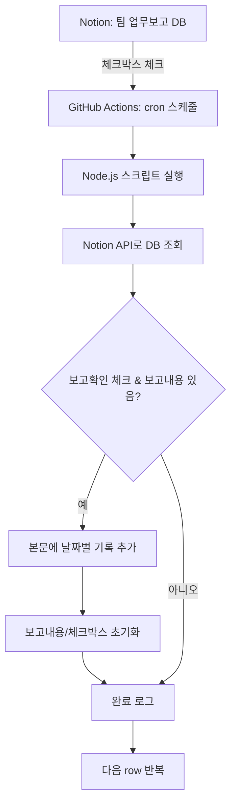

# Notion 팀 업무보고 자동화

## 프로젝트 개요
- **목표:** Notion의 "팀 업무보고" 페이지에서 "보고확인"이 체크된 row의 "금주/차주 보고내용"을 본문에 날짜별로 자동 기록하고, 보고내용은 초기화하는 자동화 시스템입니다.
- **구현:** Node.js 앱 + Notion API + GitHub Actions (cron)

---

## 사용 기술
- Node.js
- Notion 공식 API (@notionhq/client)
- GitHub Actions (스케줄러/CI)
- dotenv (환경변수)

---

## 개발 및 운영 순서

1. **Notion 통합(Integration) 생성**
   - Notion 개발자 페이지에서 Internal Integration 생성
   - 권한: 읽기/쓰기 모두 허용
2. **Notion DB(팀 업무보고) 공유**
   - "팀 업무보고" 데이터베이스(페이지)에서 Integration을 초대(공유)
3. **GitHub 저장소 준비**
   - 이 프로젝트를 clone 또는 업로드
4. **GitHub Secrets 등록**
   - `NOTION_TOKEN`: Notion Integration에서 발급받은 시크릿 키
   - `NOTION_DATABASE_ID`: 업무보고 DB의 ID
   - (필요시 `DATABASE_ID`도 동일 값으로 등록)
5. **로컬 테스트 (선택)**
   - .env 파일에 위 값 입력 후 `npm install && node index.js`로 동작 확인
6. **GitHub Actions 워크플로우 실행**
   - Actions 탭에서 수동 실행 또는 스케줄(예: 평일 9~18시 5분마다) 자동 실행
7. **Notion에서 결과 확인**
   - "보고확인" 체크 → 본문에 날짜별 기록 → 보고내용/체크박스 초기화

---

## 사용법

1. **GitHub 저장소 Settings → Secrets and variables → Actions**
   - `NOTION_TOKEN`, `NOTION_DATABASE_ID` 등록
2. **Actions 탭에서 워크플로우 수동 실행 또는 자동 스케줄 대기**
3. **Notion "팀 업무보고" 페이지에서 체크 후 결과 확인**

---

## 폴더 구조
```
notion-webhook-runner/
├── .github/
│   └── workflows/
│       └── cron.yml        # GitHub Actions 워크플로우
├── index.js                # Node.js 자동화 스크립트
├── package.json
├── .env                   # (로컬 테스트용, git에는 미포함)
└── README.md
```

---

## 전체 동작 Flowchart



---

## 주요 코드/구조 설명
- **index.js**: Notion DB를 조회해 조건에 맞는 row만 본문에 기록, 칼럼 비움, 체크 해제
- **cron.yml**: GitHub Actions에서 5분마다(평일 9~18시) 자동 실행, secrets로 인증정보 주입
- **구분선/날짜/내용**: Notion 본문에 divider, 날짜, 내용 순으로 기록되어 가독성 높음

---

## 문의
- IT팀 또는 저장소 이슈로 문의 바랍니다. 